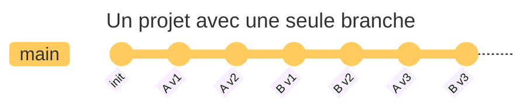
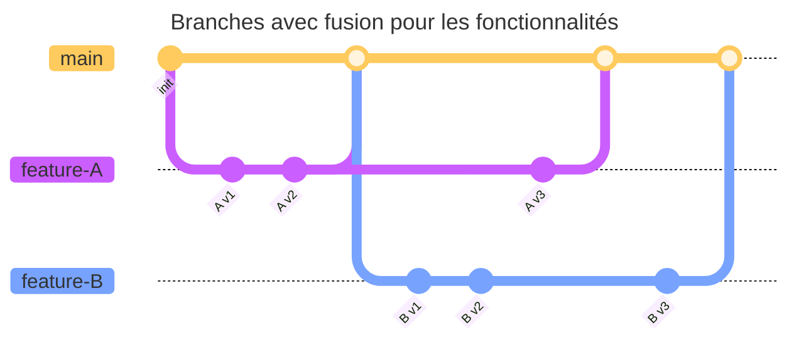

# Travailler avec plusieurs branches

Chaque validation dans l'historique d'un projet peut être considérée comme un
point de sauvegarde du projet à un moment donné. Une nouvelle validation ajoute
une nouvelle version du projet à l'historique. Or, lorsqu'on travaille à
plusieurs ou lorsqu'il y a plusieurs fonctionnalités en développement, il n'est
pas souhaitable d'empiler toutes les modifications les unes sur les autres. Ceci risque
d'être très difficile à gérer et à comprendre.

Par exemple, le graphique ci-dessous montre un projet avec une seul branche
`main` et plusieurs validations sur des fonctionnalités différentes. Il est
difficile de restorer le projet à une version antérieure sans perdre les
modifications des autres fonctionnalités.

C'est là que les branches entrent en jeu. Elles permettent de travailler sur
des fonctionnalités ou des corrections sans affecter la branche principale du
projet. Cela permet de développer plusieurs fonctionnalités en parallèle, de
tester des modifications avant de les intégrer dans la branche principale, ou
de corriger des bugs sans perturber le travail en cours. Bref, voici quelques raisons
d'utiliser des branches:

- **Développement parallèle** : Travailler sur plusieurs fonctionnalités en
  même temps sans interférer les unes avec les autres.
- **Tests et validation** : Tester des modifications dans une branche séparée
  avant de les fusionner dans la branche principale.
- **Collaboration** : Permettre à plusieurs personnes de travailler sur le même
  projet sans se marcher sur les pieds.
- **Gestion des versions** : Créer des branches pour chaque version majeure du
  projet, ce qui permet de maintenir plusieurs versions en parallèle.

Voici un exemple de ce à quoi cela ressemble dans Git avec plusieurs
branches pour les fonctionnalités A, B et C :

