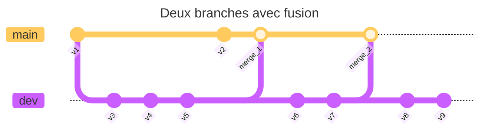

# Travailler avec plusieurs branches

Nous avons vu à la section [Git à la
mitaine](./git_how_it_works/git_mitaine.mdx) qu'il est possible de revenir en
arrière dans l'historique d'un projet. Lorsque cela arrive, l'historique de
notre projet ressemble à un arbre avec plusieurs branches. Il est aussi
possible de simplement bifurquer dans l'historique du projet pour y ajouter de
nouvelles fonctionnalités sans perturber le travail en cours. À l'inverse, il
est aussi possible de fusionner des branches pour rassembler le travail de
plusieurs personnes ou de plusieurs fonctionnalités dans une seule branche.
Dans tous ces cas, l'historique ressemble encore à un graphe avec plusieurs
branches. Voici un exemple de ce à quoi cela ressemble dans Git avec deux
branches `main` et `dev` :

Dans cette section, nous allons voir comment créer et utiliser des branches
dans Git.

## Pourquoi utiliser des branches ?

Les branches permettent de travailler sur des fonctionnalités ou des corrections
sans affecter la branche principale du projet. Cela permet de développer
plusieurs fonctionnalités en parallèle, de tester des modifications avant de
les intégrer dans la branche principale, ou de corriger des bugs sans perturber
le travail en cours. Voici quelques raisons d'utiliser des branches :

- **Développement parallèle** : Travailler sur plusieurs fonctionnalités en
  même temps sans interférer les unes avec les autres.
- **Tests et validation** : Tester des modifications dans une branche séparée
  avant de les fusionner dans la branche principale.
- **Collaboration** : Permettre à plusieurs personnes de travailler sur le même
  projet sans se marcher sur les pieds.
- **Gestion des versions** : Créer des branches pour chaque version majeure du
  projet, ce qui permet de maintenir plusieurs versions en parallèle.

