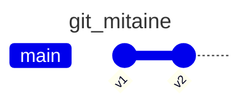
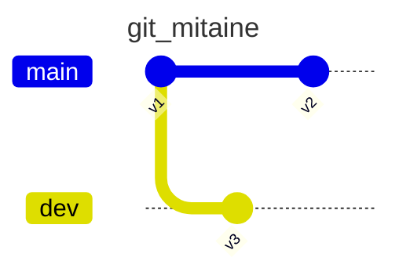

# Comment fonctionne Git?

:::info

Le livre [Pro Git](https://git-scm.com/book/fr/v2) est une excellente ressource
pour comprendre le fonctionnement de Git. Il est disponible en ligne
gratuitement et couvre en détail les concepts fondamentaux ainsi que les
fonctionnalités avancées de Git. Cette section en résume l'essentiel.

:::

## Git à la mitaine

Nous avons tous déjà implanté, manuellement, un système de gestion de versions.
Est-ce que le nom de fichier `projet_final_v2.docx` vous dit quelque chose ?
Pour bien comprendre comment fonctionne Git, rien de mieux que de le simuler à
la main. 

## Mise en place

Commençons d'abord par créer un dossier `git_mitaine` pour notre projet et créons deux fichiers
texte, `fichierA.txt` et `fichierB.txt`. L'arborescence du projet devrait ressembler à ceci :

```
git_mitaine/
├── fichierA.txt
└── fichierB.txt
```

Nous venons de voir le premier concept de Git : le **dépôt**. Un dépôt est un
dossier qui contient tous les fichiers d'un projet ainsi que l'historique des
modifications. Dans notre cas, le dépôt est `git_mitaine`. Ainsi, un dépôt Git est
simplement un dossier qui contient tous les fichiers du projet ainsi que
l'historique des modifications apportées à ces fichiers.

## Première version

Nous allons écrire de grandes choses dans les fichiers `fichierA.txt` et `fichierB.txt`. Mais commençons simplement par écrire
le contenu suivant dans le fichier `fichierA.txt` :

```
All your base are belong to us
```

et dans le fichier `fichierB.txt` :

```
Winter is installing.
```

Viens maintenant le temps de sauvegarder notre travail, pour conserver un
historique. Un peu tanné des noms de fichiers du style `fichierA_v1.txt`, nous
allons créer un sous-dossier `historique/v1` et simplement tout copier dans ce
dossier. Notre architecture de projet ressemble maintenant à ceci :

```
git_mitaine/
├── fichierA.txt
├── fichierB.txt
└── historique/
    └── v1/
        ├── fichierA.txt
        └── fichierB.txt
```

Nous venons de voir un concept très important de Git. Pour chaque "sauvegarde",
Git fait une copie **complète** du dossier du projet. Ainsi, chaque
"sauvegarde" contient l'ensemble des fichiers du projet et pas seulement les
modifications. L'action de faire une sauvegarde dans Git est appelée une
**validation** ou commit en anglais. Cela crée un instantané (snapshot) complet du projet à un
instant donné.

:::note

Soyez sans crainte, Git ne duplique pas inutilement les fichiers. Il
utilise des techniques d'optimisation pour ne stocker que les différences entre
les versions, mais conceptuellement il est important de comprendre d'une validation
correspond à une copie complète du projet à un instant donné.

:::

On remarque aussi que nous avons créé un dossier `historique` pour conserver
les différentes versions. En fait, Git nomme ce dossier `.git`. Tout, tout,
tout le travail de Git se fait dans ce dossier `.git`. Il contient l'historique des
modifications, les branches, les configurations, etc. Il est donc très
important de ne pas toucher à ce dossier.

Git utilise le terme répertoire de travail, working directory en anglais, pour
désigner le dossier principal du projet, c'est-à-dire le dossier qui contient
les fichiers du projet. Dans notre cas, le répertoire de travail est
`git_mitaine`. On peut considérer que le dossier `.git` (`historique` dans notre exemple) ne fait pas partie
du répertoire de travail, mais qu'il est plutôt un dossier interne au fonctionnement de Git.

## Deuxième version

Nous allons maintenant modifier les fichiers `fichierA.txt` et `fichierB.txt` pour
y ajouter du contenu. Modifier le fichier `fichierA.txt` pour qu'il contienne :

```
All your base are belong to us
- Superman, 1756 (??)
```

et le fichier `fichierB.txt` pour qu'il contienne :

```
Winter is installing.
- Lord Tywin Lannister (pas certain...)
```

On aimerait bien sûr conserver cette nouvelle version, alors on va créer un nouveau
dossier `historique/v2` et y copier les fichiers modifiés. 


Sauf qu'on est un peu geek sur les bords et on aime beaucoup les métadonnées.
On va donc ajouter un fichier `metadata.txt` dans chaque sauvegarde pour
conserver des informations sur la validation. Le fichier `metadata.txt` de la
validation `v1` contiendra :

```
Date: 2025-06-01
Auteur: Vincent Anonyme
Message: Première version
Version précédente: null
```

et le fichier `metadata.txt` de la validation `v2` contiendra :

```
Date: 2025-06-02
Auteur: Vincent Anonyme
Message: Deuxième version
Version précédente: v1
```


Notre projet ressemble maintenant à ceci :

```
git_mitaine/
├── fichierA.txt
├── fichierB.txt
└── historique/
    ├── v1/
    │   ├── fichierA.txt
    │   ├── fichierB.txt
    │   └── metadata.txt
    └── v2/
        ├── fichierA.txt
        ├── fichierB.txt
        └── metadata.txt
```

Tout comme nous venons de le faire, Git ajoute des métadonnées à chaque
validation. Ces métadonnées sont très importantes, car elles permettent de
comprendre l'historique du projet. Elles contiennent généralement :
- La date de la validation
- L'auteur de la validation
- Un message décrivant les modifications apportées
- La version précédente (ou le parent) de la validation

Ainsi, les validations sont chainées entre elles. On peut donc facilement
naviguer dans l'historique du projet en suivant les versions précédentes.
Graphiquement, notre projet ressemble à ceci :



Chaque point dans le graphe représente une validation et, mis à part la
validation initiale, chaque validation a une version précédente.

## Troisième version

Maintenant que nous avons plusieurs validations dans notre historique, une question se pose:
*Lors de la prochaine validation, quelle validation sera le parent ?* Il peut sembler intuitif
que la plus récente validation soit le parent de la nouvelle validation, mais ce n'est pas
obligatoire. Peut-être que la dernière validation a été faite tard un vendredi soir et qu'au final,
lundi matin, on réalise qu'on aurait mieux fait de rentrer chez soi ! Il est en effet peu probable que 
Lord Tywin Lannister ait dit "Winter is installing".

De plus, pour l'instant nous avons toujours valider l'ensemble des fichiers du répertoire de travail.
Or on pourrait bien vouloir valider seulement certains fichiers et d'autres pas. Ainsi, pour se donner
un peu plus de flexibilité, on va créer un dossier `historique/prochaine_validation`.

Ce dossier va contenir deux choses :
1. Un fichier `parent.txt` qui indique qui est le parent de la prochaine validation.
2. L'ensemble des fichiers qui feront partie de la prochaine validation. Initialement, ces fichiers
    proviendront du parent.

Donc par exemple, si l'on décide de repartir de la validation `v1`, le dossier
`prochaine_validation` ressemblera à ceci :

```
git_mitaine/
├── fichierA.txt
├── fichierB.txt
└── historique/
    ├── v1/
    │   ├── fichierA.txt
    │   ├── fichierB.txt
    │   └── metadata.txt
    ├── v2/
    │   ├── fichierA.txt
    │   ├── fichierB.txt
    │   └── metadata.txt
    └── prochaine_validation/
        ├── parent.txt     -- Indique que le parent est v1
        ├── fichierA.txt   -- Indentique à v1
        └── fichierB.txt   -- Indentique à v1
```

Ensuite nous modifions nos fichiers `fichierA.txt` et `fichierB.txt` pour y ajouter du contenu.
Le fichier A contient maintenant :

```
All your base are belong to us
- CATS, Zero Wing 1991
```

et le fichier `fichierB.txt` contient :

```
Winter is installing.
- Ned Stark, A Game of Thrones 1996
```

Nous sommes assez certain cette fois-ci que le fichier `fichierA.txt` est correct. On voudrait
donc valider ce fichier uniquement. Puisque c'est le dossier `prochaine_validation` qui
contient les fichiers qui seront validés, on va simplement remplacer le fichier `fichierA.txt`
dans le dossier `prochaine_validation` par le nouveau fichier du répertoire de travail. Le dossier `prochaine_validation`
ressemble maintenant à ceci :

```
git_mitaine/
├── fichierA.txt
├── fichierB.txt
└── historique/
    ├── v1/
    │   ├── fichierA.txt
    │   ├── fichierB.txt
    │   └── metadata.txt
    ├── v2/
    │   ├── fichierA.txt
    │   ├── fichierB.txt
    │   └── metadata.txt
    └── prochaine_validation/
        ├── parent.txt     -- Indique que le parent est v1
        ├── fichierA.txt   -- Indentique au répertoire de travail
        └── fichierB.txt   -- Indentique à v1
```

Ensuite, nous créons la version `v3` en copiant le dossier
`prochaine_validation` dans le dossier `historique/v3`. Les métadonnées de la
validation `v3` seront les suivantes :

```
Date: 2025-06-03
Auteur: Vincent Anonyme
Message: Troisième version
Version précédente: v1
```

Notre projet ressemble maintenant à ceci :

```
git_mitaine/
├── fichierA.txt
├── fichierB.txt
└── historique/
    ├── v1/
    │   ├── fichierA.txt
    │   ├── fichierB.txt
    │   └── metadata.txt
    ├── v2/
    │   ├── fichierA.txt
    │   ├── fichierB.txt
    │   └── metadata.txt
    └── v3/
        ├── fichierA.txt
        ├── fichierB.txt
        └── metadata.txt
    └── prochaine_validation/
        ├── parent.txt     -- Indique que le parent est v3
        ├── fichierA.txt   -- Identique à v3
        └── fichierB.txt   -- Identique à v3
```

Par convention, lorsqu'on fait une validation, le dossier
`prochaine_validation` est réinitialisé pour préparer la prochaine
validation avec comme parent la dernière validation et ses fichiers.

Graphiquement, notre projet ressemble à ceci :

